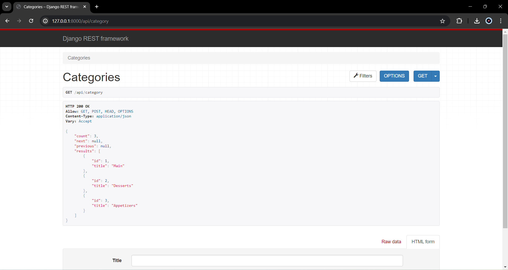
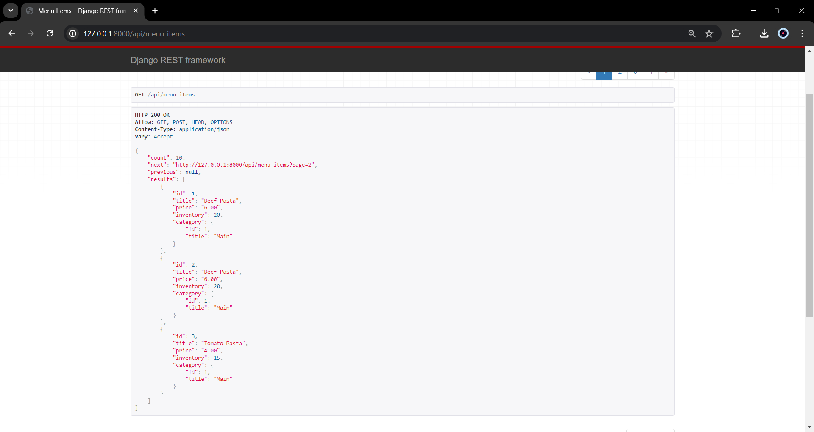
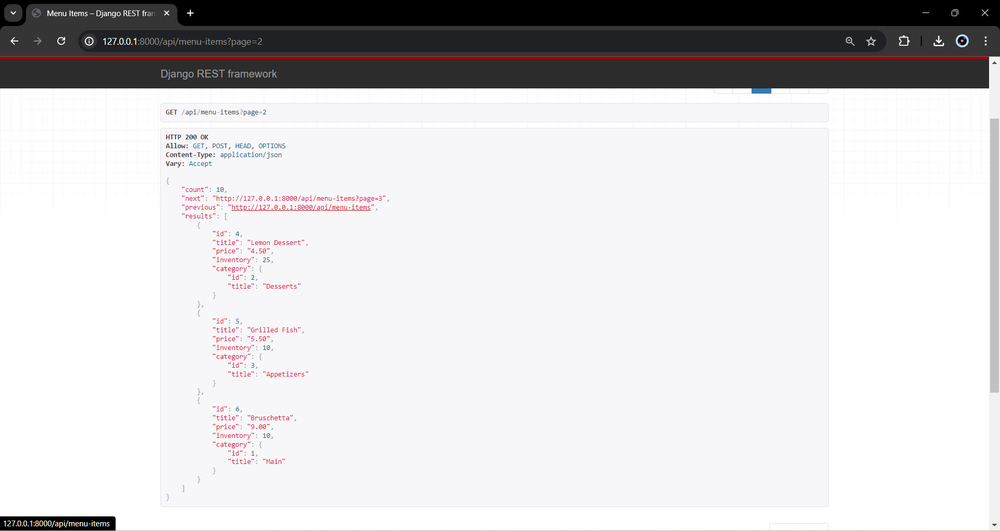
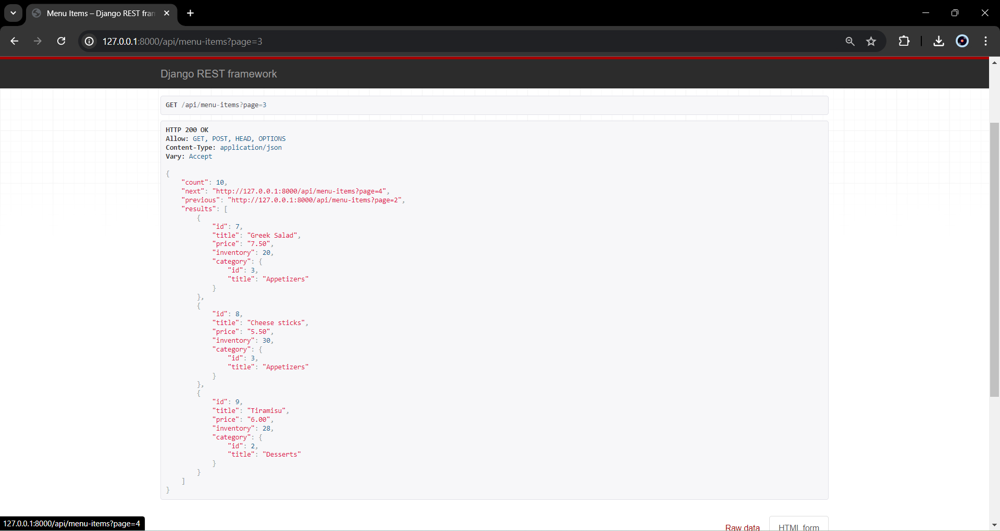
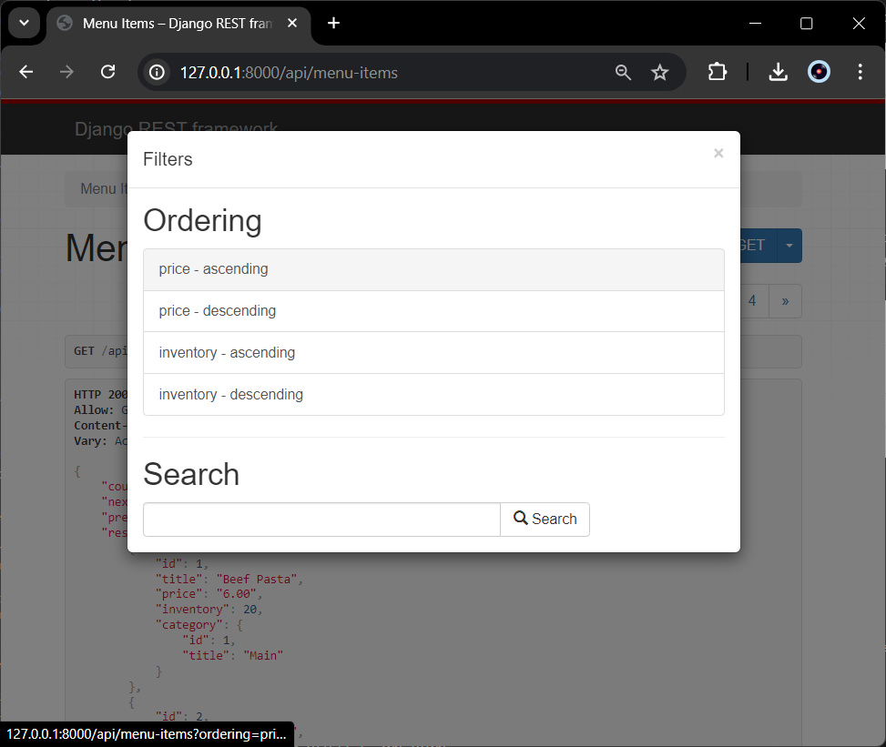
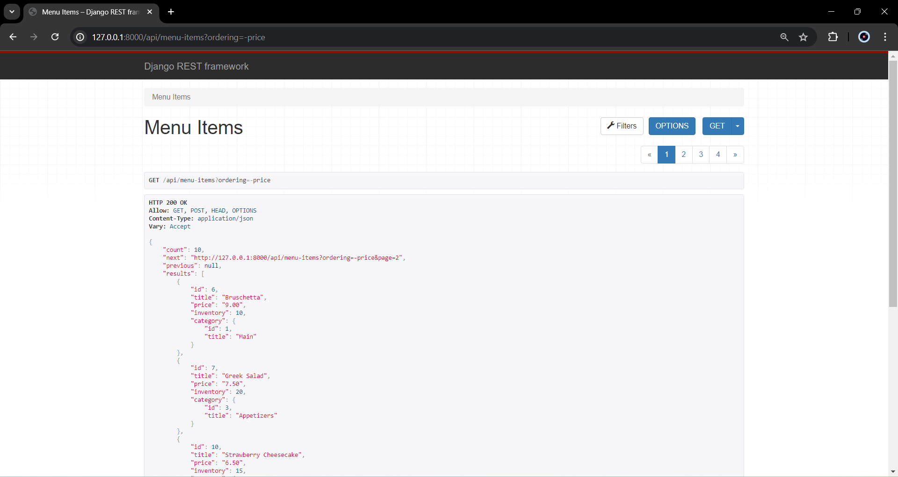
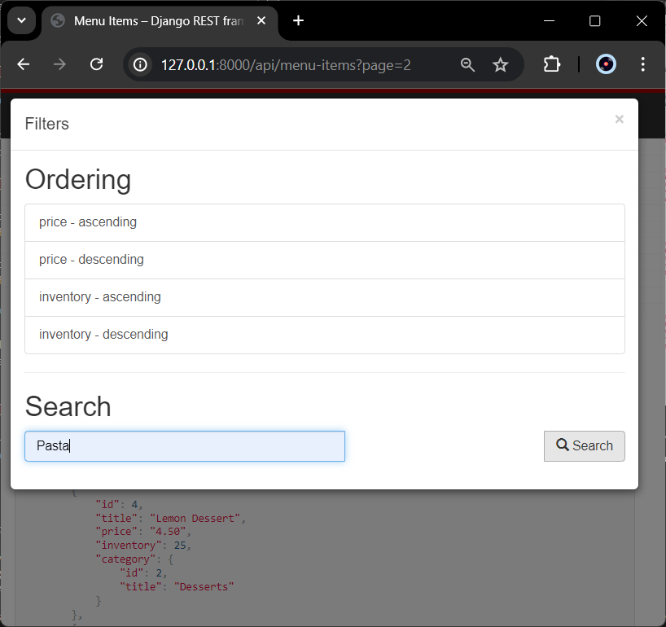
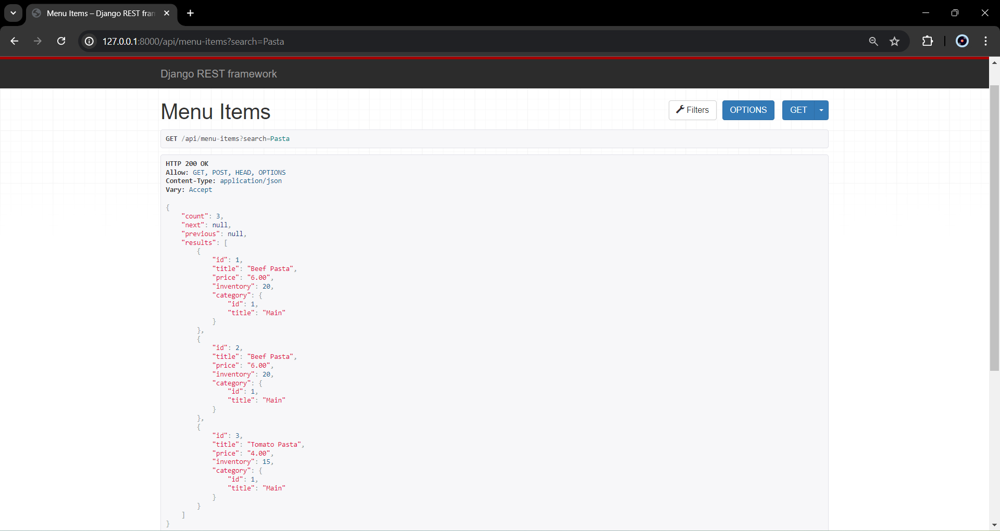

# Repository Untuk Eksplorasi Pembuatan Restaurant API Dengan Filtering, Ordering and Searching Django Rest Fraemework

```
Setting up category:
http://127.0.0.1:8000/api/category
```


```
Display menu item with implementation of pagination 3 items to display:
http://127.0.0.1:8000/api/menu-items
```







```
Filtering and Ordering by :
price - ascending
price - descending
inventory - ascending
inventory - descending
```



```
example price descending
http://127.0.0.1:8000/api/menu-items?ordering=-price
```



```
Searching by name:

Example search pasta : http://127.0.0.1:8000/api/menu-items?search=Pasta
```


```
Result By Searching Pasta
```

